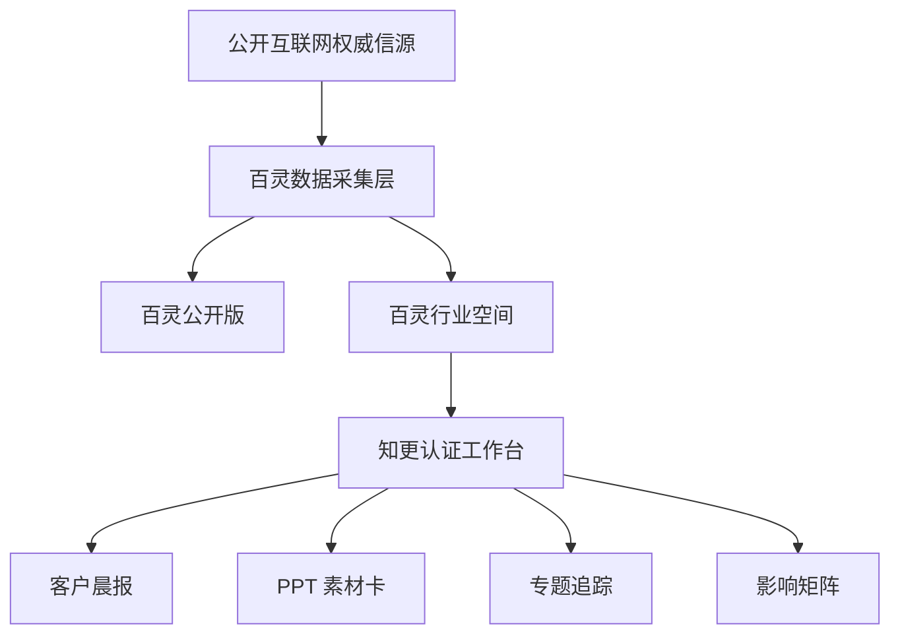
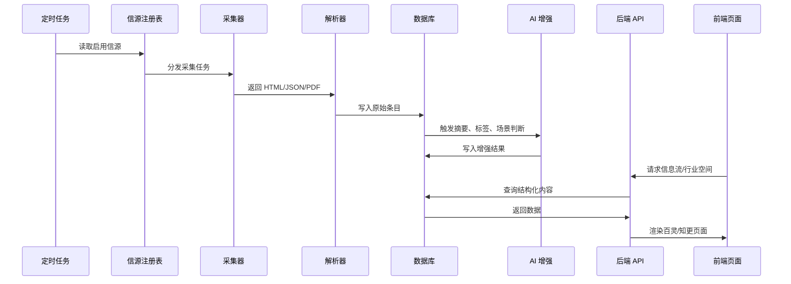
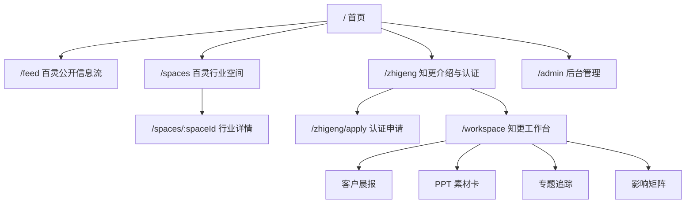
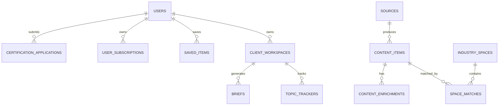
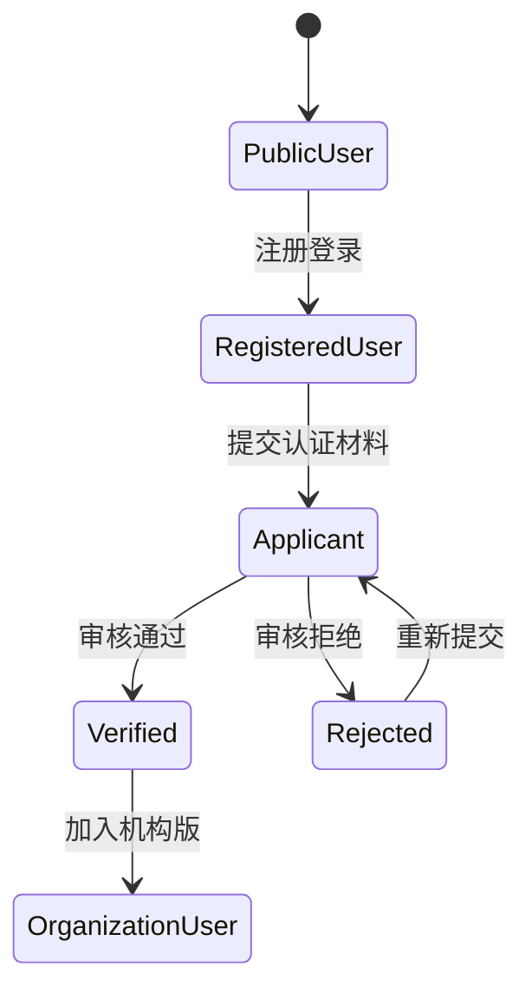
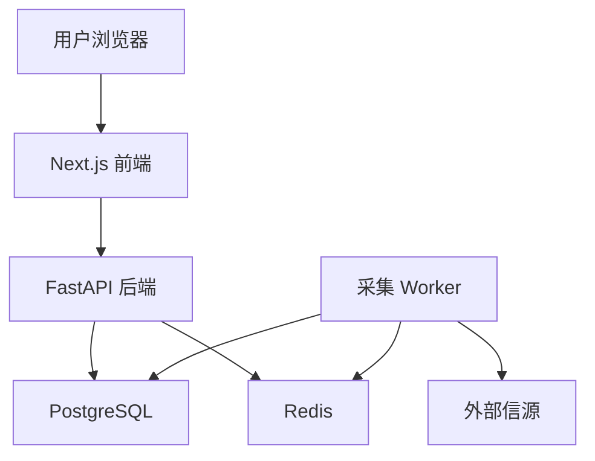

# 百灵 / 知更平台开发文档 v1

生成日期：2026-06-13  
文档定位：产品与技术开发说明书第一版  
当前阶段：静态原型已完成，准备进入可运行工程框架

---

## 1. 项目概述

### 1.1 项目名称

本平台采用双品牌结构：

- **百灵**：公开版信息聚合平台，面向普通用户、企业经营者、行业从业者、研究人员。
- **知更**：专业认证层，面向咨询顾问、行业研究员、投融资人员、政府园区和企业战略人员。

### 1.2 核心愿景

建设一个面向“政策、产业、宏观、企业动向、资本市场、研究报告”的垂直信息聚合与推送平台。

它不是泛新闻网站，也不是单纯 RSS 阅读器，而是一个能帮助用户持续追踪国家政策、地区政策、行业趋势、龙头公司动向、券商/投资机构观点和研究报告的信息工作台。

对普通用户而言，它是一个可浏览的权威信息入口。  
对专业用户而言，它是一个可认证、可订阅、可生成晨报和咨询素材的工作台。

### 1.3 当前已完成的原型进度

当前已经完成 3 个静态可验证阶段：

1. **百灵公开版 MVP-1**
   - 接入公开权威源。
   - 真实采集政策、宏观数据、财政金融信息。
   - 输出信息流、搜索、筛选、来源状态。

2. **百灵行业空间 MVP-2**
   - 将同一批真实数据映射到不同行业/场景。
   - 已有空间：管理咨询、制造业、能源与基础设施、财政金融、区域招商、宏观经营。

3. **知更认证工作台 MVP-3**
   - 设计公开用户、认证申请中、知更认证顾问三类账号状态。
   - 预留客户晨报、PPT 素材卡、影响矩阵、专题追踪等专业功能。

---

## 2. 用户与产品分层

### 2.1 用户分层

| 用户类型 | 典型用户 | 主要需求 | 对应产品层 |
|---|---|---|---|
| 普通用户 | 关注政策和产业趋势的个人 | 浏览权威信息、了解政策趋势 | 百灵公开版 |
| 企业经营者 | 企业老板、高管、战略人员 | 了解政策变化、宏观走势、行业机会 | 百灵公开版 + 行业空间 |
| 咨询顾问 | 管理咨询、战略咨询、产业咨询顾问 | 客户晨报、项目背景、政策解读、汇报素材 | 知更认证层 |
| 行业研究员 | 券商、投资机构、产业研究人员 | 专题追踪、报告线索、行业数据 | 知更认证层 |
| 政府/园区人员 | 招商、产业规划、政策研究人员 | 区域政策、招商线索、产业目录 | 百灵行业空间 + 知更 |

### 2.2 产品层级



### 2.3 功能分层

| 层级 | 名称 | 用户权限 | 功能 |
|---|---|---|---|
| L0 | 公开浏览 | 无需登录 | 信息流、来源、原文链接、基础搜索 |
| L1 | 注册用户 | 登录后 | 收藏、行业偏好、订阅关键词 |
| L2 | 认证申请中 | 提交材料后 | 试用晨报、申请进度、有限专题 |
| L3 | 知更认证顾问 | 审核通过后 | 客户晨报、专题追踪、素材卡、影响矩阵、项目资料夹 |
| L4 | 机构/团队版 | 企业或团队开通 | 团队空间、客户库、协作、权限管理 |

---

## 3. 信源策略

### 3.1 信源原则

第一阶段以公开、权威、可验证的信源为核心。

采集原则：

- 保留原始链接。
- 不全文搬运受版权保护内容。
- 优先采集标题、日期、来源、摘要、标签、原文 URL。
- AI 生成的是“摘要、分类、咨询价值判断、提醒”，不是替代原文。
- 微信公众号、研报 PDF、第三方付费内容需要授权或人工候选流程。

### 3.2 第一批权威公开源

| 信源 | 类型 | 当前状态 | 说明 |
|---|---|---|---|
| 国务院最新政策 | 国家政策 | 已接入 | JSON 源稳定 |
| 国家发改委政策发布 | 国家政策 | 已接入 | HTML 列表 |
| 国家发改委通知 | 国家政策 | 已接入 | HTML 列表 |
| 国家发改委公告 | 国家政策 | 已接入 | HTML 列表 |
| 国家统计局数据发布 | 宏观数据 | 已接入 | HTML 列表 |
| 国家统计局统计新闻 | 宏观数据 | 已接入 | HTML 列表 |
| 财政部财政新闻 | 财政金融 | 已接入 | HTML 列表 |
| 人民银行工作动态 | 财政金融 | 待微调 | 需要专门解析结构 |

### 3.3 第二批适配源

| 信源 | 目标价值 | 接入难点 |
|---|---|---|
| 工信部文件发布 | 制造业、产业政策 | 搜索应用渲染，需要接口适配 |
| 商务部政策发布 | 外贸、外资、消费 | 页面组件化，需适配器 |
| 上交所上市公司公告 | 龙头公司动向 | 动态表格，需要公告接口 |
| 深交所上市公司公告 | 龙头公司动向 | 动态表格，需要公告接口 |
| 省市政府政策网站 | 地区政策、招商 | 各地结构差异大 |
| 券商研究报告公开页 | 行业观点 | 版权与结构不一 |
| 36氪等产业媒体 | 公司动态、融资 | 需控制版权和摘要范围 |
| 微信公众号 | 垂直观点 | 需要授权、候选清单或手动导入 |

---

## 4. 整体系统架构

### 4.1 推荐技术架构

前端建议：

- Next.js / React
- TypeScript
- Tailwind CSS 或 CSS Modules
- shadcn/ui 可选

后端建议：

- Python FastAPI 或 Node.js NestJS
- 推荐 Python FastAPI，因为采集、解析、AI 处理、PDF 处理更顺手

数据库：

- PostgreSQL：核心业务数据
- Redis：任务队列、缓存、限流
- 对象存储：PDF、截图、附件、生成报告

任务系统：

- Celery / RQ / Dramatiq
- 或轻量阶段使用 APScheduler

搜索：

- MVP 阶段：PostgreSQL full-text search
- 成熟阶段：Meilisearch / OpenSearch / Elasticsearch

AI 能力：

- 摘要
- 标签
- 行业空间匹配
- 咨询价值判断
- 晨报生成
- PPT 素材卡生成

### 4.2 总体架构图

```mermaid
flowchart LR
  subgraph Sources["外部信源"]
    S1["政府政策网站"]
    S2["统计数据网站"]
    S3["交易所公告"]
    S4["媒体与报告"]
    S5["授权公众号/手动导入"]
  end

  subgraph Ingestion["采集与处理层"]
    C1["Source Registry"]
    C2["Crawler Adapter"]
    C3["Parser"]
    C4["Deduplication"]
    C5["AI Enrichment"]
  end

  subgraph Storage["数据层"]
    D1["PostgreSQL"]
    D2["Redis"]
    D3["Object Storage"]
    D4["Search Index"]
  end

  subgraph Backend["后端 API"]
    A1["Public Feed API"]
    A2["Industry Space API"]
    A3["Auth & User API"]
    A4["Zhigeng Pro API"]
    A5["Admin API"]
  end

  subgraph Frontend["前端应用"]
    F1["百灵公开版"]
    F2["百灵行业空间"]
    F3["知更认证工作台"]
    F4["后台管理"]
  end

  Sources --> Ingestion
  Ingestion --> Storage
  Storage --> Backend
  Backend --> Frontend
```



### 4.3 数据处理流程



---

## 5. 前端设计

### 5.1 页面结构



### 5.2 百灵公开版页面

核心模块：

- 顶部概览：采集条目数、信源数、最新日期。
- 信息流：标题、来源、日期、分类、标签、原文链接。
- 筛选器：政策、宏观数据、财政金融、行业动态等。
- 搜索框：标题、标签、来源、关键词。
- 信源健康度：已接入、待微调、异常、待适配。
- 下一批信源队列：展示即将接入的源。

### 5.3 百灵行业空间页面

核心模块：

- 行业空间 Tab。
- 空间摘要：今日重点、适用人群、推荐关注。
- 匹配信息卡：按行业规则从底层信息流中筛选。
- 知更工具预览：认证后开放的专业能力。
- 待补信源：该行业还需要接入的数据源。

默认空间：

- 管理咨询
- 制造业
- 能源与基础设施
- 财政金融
- 区域招商
- 宏观经营

后续可扩展：

- 化工
- 法律
- 医疗
- 消费
- 房地产
- 物流
- 科技
- 农业

### 5.4 知更认证工作台页面

核心模块：

- 账号状态：公开用户、申请中、认证顾问。
- 认证流程：选择身份、选择行业、提交证明、开通权限。
- 专业工具：客户晨报、PPT 素材卡、影响矩阵、专题追踪。
- 行业空间接入：把百灵空间接入知更工作台。
- 项目资料夹：后续用于保存客户、专题、素材。

---

## 6. 后端模块设计

### 6.1 后端服务划分

| 模块 | 职责 |
|---|---|
| Source Service | 信源注册、启停、状态监控 |
| Crawl Service | 定时采集、失败重试、限流 |
| Parse Service | HTML/JSON/PDF 解析 |
| Content Service | 信息条目查询、去重、分类 |
| Enrichment Service | 摘要、标签、空间匹配、顾问价值 |
| User Service | 注册、登录、角色、认证 |
| Zhigeng Service | 晨报、素材卡、专题追踪 |
| Admin Service | 信源管理、内容审核、用户审核 |

### 6.2 后端目录建议

```text
backend/
  app/
    main.py
    core/
      config.py
      security.py
      logging.py
    db/
      session.py
      models.py
      migrations/
    modules/
      sources/
      crawler/
      parser/
      contents/
      spaces/
      users/
      auth/
      zhigeng/
      admin/
    workers/
      crawl_tasks.py
      enrich_tasks.py
      digest_tasks.py
    integrations/
      openai_client.py
      storage_client.py
    tests/
```

### 6.3 前端目录建议

```text
frontend/
  app/
    page.tsx
    feed/
      page.tsx
    spaces/
      page.tsx
      [spaceId]/
        page.tsx
    zhigeng/
      page.tsx
      apply/
        page.tsx
    workspace/
      page.tsx
      briefs/
      ppt-cards/
      trackers/
    admin/
      page.tsx
  components/
    layout/
    feed/
    spaces/
    zhigeng/
    common/
  lib/
    api.ts
    auth.ts
    types.ts
```

---

## 7. 数据库设计

### 7.1 核心实体关系



### 7.2 表结构建议

#### users

| 字段 | 类型 | 说明 |
|---|---|---|
| id | uuid | 用户 ID |
| email | text | 邮箱 |
| phone | text | 手机号 |
| name | text | 昵称/姓名 |
| role | enum | public/applicant/verified/admin |
| created_at | timestamp | 创建时间 |
| updated_at | timestamp | 更新时间 |

#### certification_applications

| 字段 | 类型 | 说明 |
|---|---|---|
| id | uuid | 申请 ID |
| user_id | uuid | 用户 ID |
| identity_type | text | 顾问/企业/研究员/政府园区 |
| industries | jsonb | 选择的行业 |
| proof_files | jsonb | 证明材料 |
| status | enum | pending/approved/rejected |
| reviewer_id | uuid | 审核人 |
| reviewed_at | timestamp | 审核时间 |

#### sources

| 字段 | 类型 | 说明 |
|---|---|---|
| id | uuid | 信源 ID |
| source_key | text | 唯一键 |
| name | text | 信源名称 |
| url | text | 首页或接口地址 |
| source_type | text | government/company/media/report/wechat |
| category | text | 国家政策/宏观数据/财政金融等 |
| adapter_type | text | html_list/json_api/dynamic/pdf/manual |
| status | enum | active/paused/error/needs_adapter |
| crawl_interval | int | 采集间隔 |
| last_crawled_at | timestamp | 最近采集时间 |

#### content_items

| 字段 | 类型 | 说明 |
|---|---|---|
| id | uuid | 内容 ID |
| source_id | uuid | 信源 ID |
| title | text | 标题 |
| url | text | 原文链接 |
| published_at | date | 发布时间 |
| category | text | 分类 |
| raw_summary | text | 原始摘要，可为空 |
| content_hash | text | 去重 hash |
| status | enum | active/hidden/duplicate |
| created_at | timestamp | 入库时间 |

#### content_enrichments

| 字段 | 类型 | 说明 |
|---|---|---|
| id | uuid | 增强 ID |
| content_item_id | uuid | 内容 ID |
| tags | jsonb | 标签 |
| summary | text | AI 摘要 |
| public_value | text | 公众价值 |
| consulting_value | text | 顾问价值 |
| risk_notes | text | 风险或注意点 |
| model | text | 使用的模型 |

#### industry_spaces

| 字段 | 类型 | 说明 |
|---|---|---|
| id | uuid | 空间 ID |
| space_key | text | consulting/manufacturing 等 |
| name | text | 空间名称 |
| audience | text | 目标用户 |
| keywords | jsonb | 匹配关键词 |
| signals | jsonb | 关注信号 |
| status | enum | active/hidden |

#### space_matches

| 字段 | 类型 | 说明 |
|---|---|---|
| id | uuid | 匹配 ID |
| space_id | uuid | 行业空间 ID |
| content_item_id | uuid | 内容 ID |
| score | int | 匹配分 |
| matched_keywords | jsonb | 命中关键词 |
| reason | text | 匹配理由 |

#### briefs

| 字段 | 类型 | 说明 |
|---|---|---|
| id | uuid | 晨报 ID |
| user_id | uuid | 用户 ID |
| client_workspace_id | uuid | 客户空间 ID |
| title | text | 晨报标题 |
| brief_type | text | daily/weekly/topic |
| content | jsonb | 晨报结构化内容 |
| export_status | text | 导出状态 |
| created_at | timestamp | 生成时间 |

---

## 8. API 设计

### 8.1 公开 API

```http
GET /api/public/feed
GET /api/public/feed/:id
GET /api/public/sources
GET /api/public/spaces
GET /api/public/spaces/:spaceKey
```

查询参数：

```text
category=国家政策
source=gov-policy-latest
keyword=投资
date_from=2026-01-01
date_to=2026-06-13
page=1
page_size=20
```

### 8.2 用户与认证 API

```http
POST /api/auth/register
POST /api/auth/login
POST /api/auth/logout
GET  /api/users/me
POST /api/certification/apply
GET  /api/certification/me
POST /api/certification/:id/review
```

### 8.3 知更专业 API

```http
GET  /api/zhigeng/workspace
POST /api/zhigeng/briefs
GET  /api/zhigeng/briefs/:id
POST /api/zhigeng/ppt-cards
POST /api/zhigeng/impact-matrix
POST /api/zhigeng/topic-trackers
GET  /api/zhigeng/topic-trackers
```

### 8.4 后台管理 API

```http
GET    /api/admin/sources
POST   /api/admin/sources
PATCH  /api/admin/sources/:id
POST   /api/admin/sources/:id/test
GET    /api/admin/crawl-runs
GET    /api/admin/certifications
POST   /api/admin/certifications/:id/approve
POST   /api/admin/certifications/:id/reject
```

---

## 9. 采集器设计

### 9.1 Source Registry

信源需要配置化，不应写死在代码里。

示例：

```json
{
  "source_key": "gov-policy-latest",
  "name": "国务院最新政策",
  "url": "https://www.gov.cn/zhengce/zuixin/ZUIXINZHENGCE.json",
  "category": "国家政策",
  "adapter_type": "json_api",
  "enabled": true,
  "crawl_interval_minutes": 120,
  "fields": {
    "title": "TITLE",
    "url": "URL",
    "published_at": "DOCRELPUBTIME"
  }
}
```

### 9.2 Adapter 类型

| 类型 | 说明 | 示例 |
|---|---|---|
| json_api | 公开 JSON 接口 | 国务院最新政策 |
| html_list | 普通 HTML 列表 | 发改委、统计局 |
| dynamic_api | 动态接口 | 交易所公告 |
| pdf_index | PDF/报告列表 | 研究报告、年报 |
| manual | 人工录入或授权导入 | 微信公众号 |

### 9.3 去重策略

优先级：

1. 原文 URL 完全一致。
2. 标题 + 日期 + 来源一致。
3. 标题相似度高于阈值。
4. content_hash 一致。

### 9.4 采集状态

每次采集需要记录：

- source_id
- started_at
- finished_at
- status
- item_count
- new_item_count
- error_message
- latency_ms

---

## 10. AI 增强设计

### 10.1 AI 处理目标

AI 不负责制造事实，只负责对已采集的公开信息做结构化加工。

主要任务：

- 生成 100-200 字摘要。
- 提取行业标签。
- 判断适合哪些行业空间。
- 生成公众价值。
- 生成顾问价值。
- 生成可能影响。
- 生成晨报条目。
- 生成 PPT 素材卡。

### 10.2 内容增强 Prompt 输入

```json
{
  "title": "国务院关于印发《现代化应急体系建设“十五五”规划》的通知",
  "source": "国务院最新政策",
  "published_at": "2026-06-08",
  "url": "https://www.gov.cn/...",
  "category": "国家政策",
  "raw_text": "可选，若合法抓取正文则传入"
}
```

### 10.3 输出结构

```json
{
  "summary": "一句到两句摘要",
  "tags": ["十五五", "应急管理", "公共治理"],
  "industry_spaces": ["管理咨询", "能源与基础设施", "区域招商"],
  "public_value": "帮助企业主理解政策方向",
  "consulting_value": "适合用于客户周报、项目背景和政策影响分析",
  "risk_notes": "需结合原文条款判断具体适用范围"
}
```

### 10.4 知更工具输出

#### 客户晨报

结构：

- 今日重点
- 政策动态
- 宏观/数据动态
- 行业影响
- 建议关注
- 原文链接

#### PPT 素材卡

结构：

- 事实标题
- 来源与日期
- 核心事实
- 对客户的影响
- 可用于哪类项目页
- 引用链接

#### 影响矩阵

维度：

- 客户类型
- 行业
- 区域
- 时间
- 机会
- 风险
- 待确认问题

---

## 11. 权限与认证

### 11.1 角色模型

| 角色 | 权限 |
|---|---|
| anonymous | 浏览公开内容 |
| user | 收藏、订阅、行业偏好 |
| applicant | 提交认证申请、试用部分功能 |
| verified_consultant | 使用知更专业工具 |
| organization_admin | 管理团队、客户空间、成员 |
| admin | 管理信源、审核认证、查看系统状态 |

### 11.2 认证流程



### 11.3 认证材料

可选材料：

- 公司邮箱
- 名片
- LinkedIn/官网/机构主页
- 项目经历说明
- 企业/机构证明
- 邀请码

---

## 12. 后台管理

后台管理是这个平台能否长期运行的关键。

### 12.1 后台模块

- 信源管理
- 采集运行状态
- 采集失败日志
- 内容审核
- 标签修正
- 行业空间规则配置
- 用户认证审核
- AI 生成结果抽检
- 版权风险标记

### 12.2 信源管理字段

- 名称
- URL
- 类型
- 适配器
- 分类
- 状态
- 采集频率
- 是否需要登录
- 是否允许正文采集
- 版权备注

---

## 13. 安全、版权与合规

### 13.1 内容合规原则

- 不绕过登录限制。
- 不抓取明确禁止采集的内容。
- 对版权内容只展示标题、摘要、来源和链接。
- 对微信公众号内容优先采用授权、手动导入、候选清单。
- 对研报、年报、PDF 等文件保留来源和引用。
- 用户导出的材料必须包含来源链接。

### 13.2 技术安全

- 登录使用 HttpOnly Cookie 或安全 Token。
- 密码使用 bcrypt/argon2。
- API 需要鉴权中间件。
- 管理后台需要 RBAC。
- 采集器需要限流和重试。
- 外部 URL 请求需要防 SSRF。
- 文件上传需要类型校验和病毒扫描。

---

## 14. 部署架构

### 14.1 MVP 部署



### 14.2 推荐部署方式

MVP 阶段：

- Frontend：Vercel / 自建 Node 服务
- Backend：云服务器 Docker Compose
- Database：托管 PostgreSQL 或 Docker PostgreSQL
- Redis：Docker Redis
- Worker：Docker worker

成熟阶段：

- Kubernetes 或云托管容器
- 分离采集集群
- 独立搜索服务
- 独立对象存储
- 监控与日志系统

---

## 15. 开发阶段路线

### 阶段 1：工程化 MVP

目标：把当前静态原型变成可运行 Web 应用。

任务：

- 建立前端项目。
- 建立后端项目。
- 建立 PostgreSQL 数据模型。
- 将当前采集脚本服务化。
- 实现公开信息流 API。
- 实现行业空间 API。
- 实现基础页面路由。

验收：

- 能定时采集公开源。
- 能在页面展示真实数据。
- 能按分类、来源、关键词筛选。
- 信源状态可查看。

### 阶段 2：账号与认证

目标：完成用户系统和知更认证流程。

任务：

- 注册登录。
- 用户角色。
- 认证申请表。
- 后台审核。
- 行业偏好。
- 收藏和订阅。

验收：

- 用户可以申请知更认证。
- 管理员可以审核。
- 已认证用户看到专业工作台。

### 阶段 3：专业工具

目标：让知更真正对顾问有用。

任务：

- 客户晨报生成。
- PPT 素材卡生成。
- 专题追踪。
- 影响矩阵。
- 客户/项目资料夹。

验收：

- 顾问可以选择行业和客户，生成一份晨报。
- 每条晨报保留原文链接。
- 可导出 Markdown 或 PPT 初稿。

### 阶段 4：信源扩展

目标：从政策/宏观扩展到更完整的产业情报。

任务：

- 工信部、商务部、人民银行适配。
- 交易所公告适配。
- 地方政策源适配。
- 年报/公告/PDF 解析。
- 公众号授权或手动导入机制。
- 36氪等产业媒体摘要接入。

验收：

- 每个行业空间至少有 20 个稳定信源。
- 每个信源有健康度监控。
- 异常采集可自动告警。

### 阶段 5：团队版与商业化

目标：支持机构、团队和垂直行业定制。

任务：

- 机构账号。
- 团队空间。
- 客户库。
- 成员权限。
- 行业模板市场。
- API 或私有化部署。

验收：

- 一个咨询团队可以共享客户晨报和专题。
- 不同行业可以有不同信源包。
- 可以面向化工、法律、能源等行业定制。

---

## 16. 当前原型文件

当前已有输出：

| 文件 | 说明 |
|---|---|
| bailing-public-mvp.html | 百灵公开版 MVP |
| bailing-public-data.json | 公开源采集数据 |
| bailing-industry-spaces.html | 百灵行业空间 MVP |
| bailing-industry-spaces-data.json | 行业空间数据 |
| zhigeng-auth-workspace.html | 知更认证工作台 MVP |
| zhigeng-auth-workspace-data.json | 认证工作台数据 |

---

## 17. 下一步建议

优先做“工程化 MVP”，不要马上追求所有信源。

建议第一轮开发顺序：

1. 搭建后端 FastAPI + PostgreSQL。
2. 把当前 `bailing-public-data.json` 的结构转成数据库表。
3. 把采集脚本改成可配置 Source Registry。
4. 搭建 Next.js 前端，复刻当前 3 个页面。
5. 接通公开信息流 API。
6. 接通行业空间 API。
7. 做用户注册登录和知更认证申请。
8. 做第一个可用的客户晨报生成。

最小可上线版本应包含：

- 10 个稳定公开信源。
- 6 个行业空间。
- 用户注册登录。
- 认证申请。
- 已认证用户生成晨报。
- 后台信源健康度。

---

## 18. 一句话产品定义

**百灵是面向公众和企业经营者的政策与产业信息入口；知更是面向认证顾问和研究型用户的专业情报工作台。**

